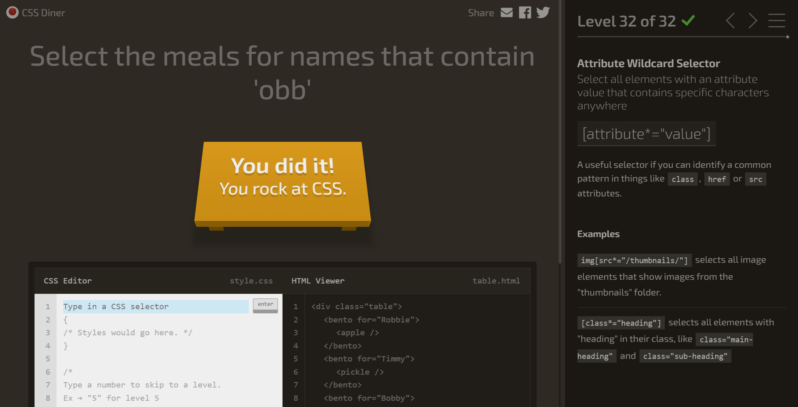
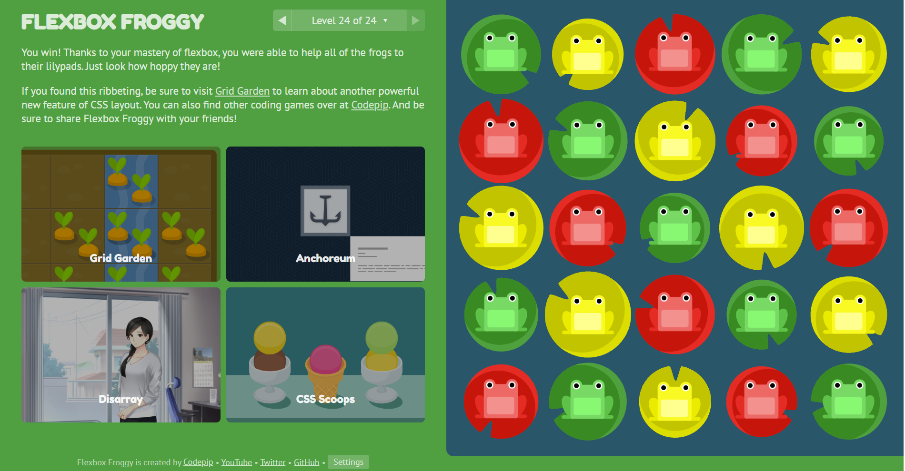
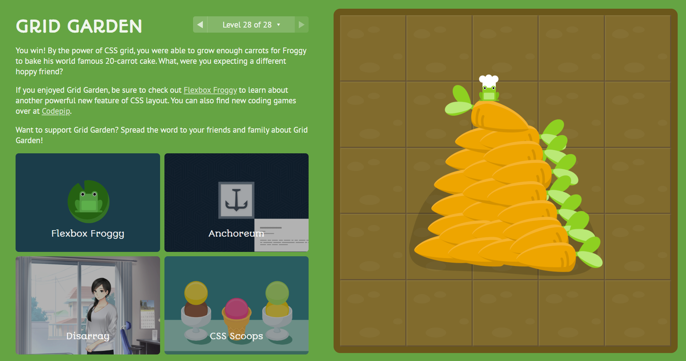
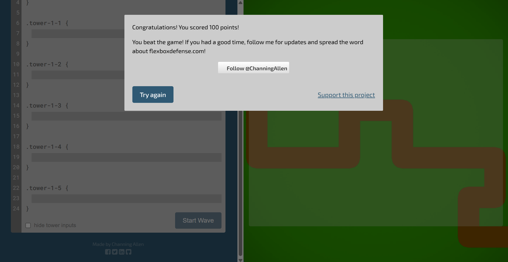

# Review
- inspect -> devtools to find fonts and colors on a website you like
- when image isn't centered, even with margin: 0 auto: add display: block to remove image from being a part of the paragraph
- how to center a div: set margin 0 auto and width
- does transition only work with hover? no, transitions work with other psuedo classes too. with hover, it makes the changes smoother rather than an immediate shift in design
- global colors to be sued across website; use :root
- why would css rule have a strike through in devtools: it is not the style being currently applied, probably due to being overwritten

# What I learned
- quick selectors: element, class, ID, descendant, grouping
- 
 block container. 
-  inline container (highlight one word in a sentence)
- display types: block and inline
- block: stack vertically, takes full width of entire row
- inline: in notes
- pseudo classes: "a keyword that is added to a selector to define a special state of an element," based on user interaction
- smooth changes: add .transition between style changes 
- server needs to send code back to every user, code must be public and exposed to everyone. can learn from everyone
CSS
- adding css, cascading and specificity
- selectors, pseudo-classes (:hover, :focus, :nth-child)
- display types, div and span, box model
- transitions, css varibles, typography, google fonts
Layout

# Other files
- s11_demo.html - for flexbox demo

# To do
- create interests.html
- flukeout.github.io screenshot: 
- look at prismic.io/blog/css-animation-examples
- flex froggy screenshot:  
- grid garden screen shot:  
- flexbox defense screenshot:  

# Mini Project 1
- Interviewed with client and got direction
- Edited the framework I already had to match their needs. This included:
    - using a more expansive css file to align all pages of the website with the clients colors, fonts, and overall prefered style
    - added significant information/content to the website, such as their variety of programs and definition of a first-generation student
- AI usage: 
    - I used it the most for finding sections of the css file instead of scrolling aimlessly
    - I also used it when I would try to change something and get stuck. An example of this is when I struggled to make the text in a specific class change from white to black. I asked AI to do it, and was able to see that I was under the wrong class in the css file.
    - I would ask it questions such as "where does .intro-text apply on the website"
- The main things that still need to be completed are: further css file cleaning, adding more images, adding correct links to the programs page

